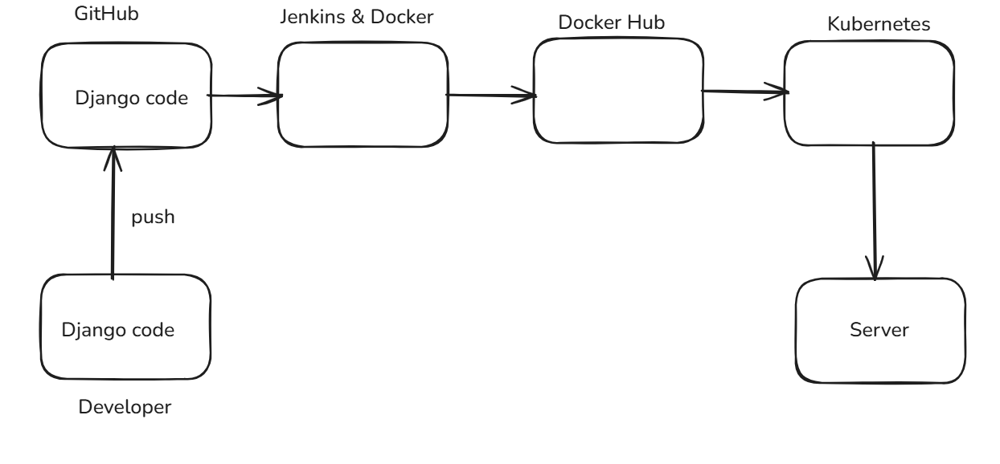
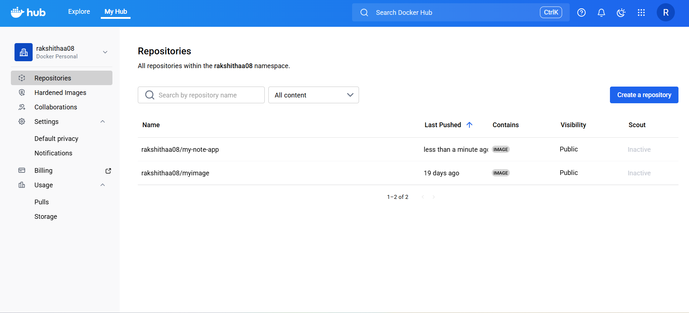

# Django CI/CD Pipeline


---

## Concepts

### Jenkins
An automation server used to implement continuous integration and continuous deployment pipelines.

### Docker
A containerization platform used to package the Django application and its dependencies into portable images.

### Kubernetes
A container orchestration system used to deploy, scale, and manage the application containers.

### Key Features
- Automated CI/CD pipeline for a Django application
- Docker image build and push to Docker Hub
- Kubernetes-based deployment using Jenkins
- Centralized credential management
- Scalable and repeatable deployment process

### Limitations
- Requires preconfigured Jenkins and Kubernetes setup
- NodePort service exposure depends on EC2 availability
- Designed for learning and demonstration purposes

---

## Deployment Steps

Full deployment instructions:  
See full deployment instructions [here](docs/deployment-steps.md)

---

## Project Structure
```
django-cicd/
│
├── docs/
│ ├── deployment-steps.md 
│ └── screenshots/
│ 	├── stage_view.png 
│ 	├── dockerhub.png
│ 	├── web_application.png
│ 	└── architecture.png # Architecture diagram
├── README.md 
└── LICENSE 
```

---

## Architecture Diagram

**Django CI/CD – Web Application Architecture**  


---

## Screenshots

**Jenkins Pipeline Stage View**  


**Docker Image on Docker Hub**  


**Django Web Application**  


---

## License

MIT License. See `LICENSE` file for details.

