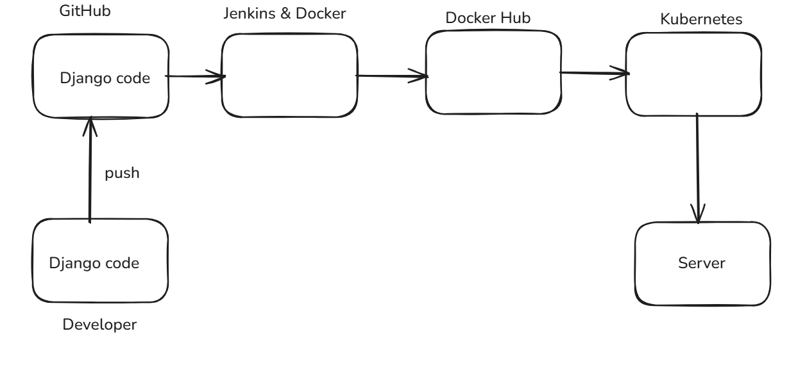
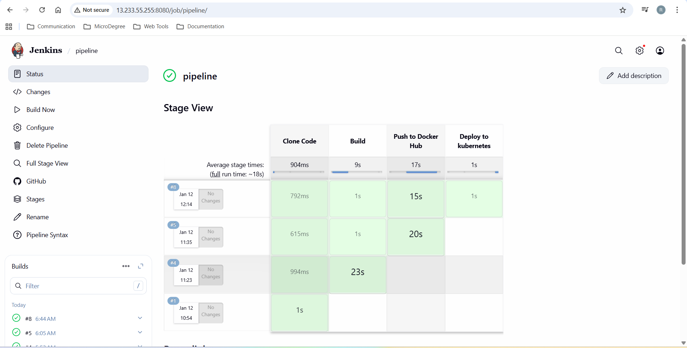
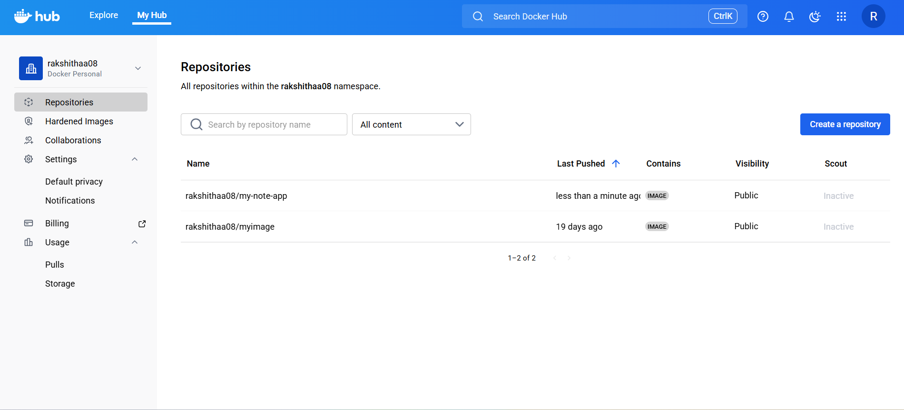
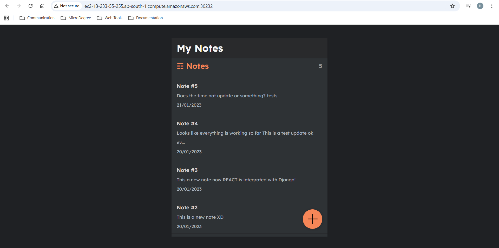

# Django CI/CD Pipeline

This project demonstrates an automated CI/CD pipeline for deploying a Django web application using Jenkins, Docker, and Kubernetes. The pipeline builds a Docker image, pushes it to Docker Hub, and deploys the application to a Kubernetes cluster.

---

## Concepts

### Technologies Used

- Jenkins
- Docker
- Kubernetes
- Docker Hub
- Django
- AWS EC2
- Git
- GitHub
- Infrastructure as Code (IaC): Kubernetes YAML manifests

### Jenkins
Runs on an AWS EC2 instance. Triggered automatically via GitHub Webhook when code is pushed to the repository, starting the pipeline to build, push, and deploy the application.

### Docker
Packages the Django app into a container image and pushes it to Docker Hub as part of the Jenkins pipeline.

### Kubernetes
Hosts the deployed Django containers. Jenkins applies the deployment.yaml and service.yaml to the cluster after every successful build.

## CI/CD Pipeline Workflow

- Developer pushes code to GitHub
- Jenkins pipeline is triggered
- Docker image is built using the Dockerfile
- Image is pushed to Docker Hub
- Jenkins deploys the application to Kubernetes
- Kubernetes manages the application lifecycle and exposes the service for **High Availability**
---
## Prerequisites
Before running this project, ensure you have the following installed and configured:
- Python 3.x
- Docker (installed on the same EC2 instance as Jenkins)
- Docker Hub account (credentials stored in Jenkins)
- Jenkins (with credentials configured for Docker Hub and Kubernetes)
- kubectl configured with your cluster
- AWS EC2 instance (hosts both Jenkins and Docker)
- Git & GitHub account (with Webhook configured to trigger Jenkins)

---
## Deployment Steps

Full deployment instructions:  
See full deployment instructions [here](docs/deployment-steps.md)

---

## Project Structure
```
django-cicd/
│
├── docs/
│   ├── deployment-steps.md
│   └── screenshots/
│       ├── stage_view.png
│       ├── dockerhub.png
│       ├── web_application.png
│       └── architecture.png
├── notesapp/
│   ├── deployment.yaml
│   └── service.yaml
├── Dockerfile
├── Jenkinsfile
├── manage.py
├── README.md
├── requirements.txt
└── LICENSE
```

---

## Architecture Diagram



---

## Screenshots

**Jenkins Pipeline Stage View**  



**Docker Image on Docker Hub**  



**Django Web Application**  



---

## About This Project
This project was built to demonstrate a real-world CI/CD workflow using Jenkins, Docker, and Kubernetes on AWS EC2. It covers:
- End-to-end pipeline automation with Jenkins
- Docker image build and registry push
- Kubernetes deployment via Jenkins

---
## Limitations
- Requires Jenkins, Docker, and Kubernetes to be preconfigured before use
- No HTTPS/TLS configured — application runs over HTTP only
- NodePort exposure is tied to EC2 public IP (not production-grade)
- No auto-scaling or health check policies configured
- Intended for learning and demonstration purposes only

---
## License

MIT License. See `LICENSE` file for details.

